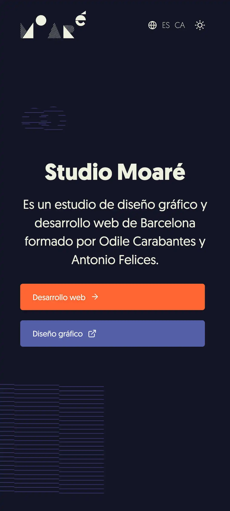
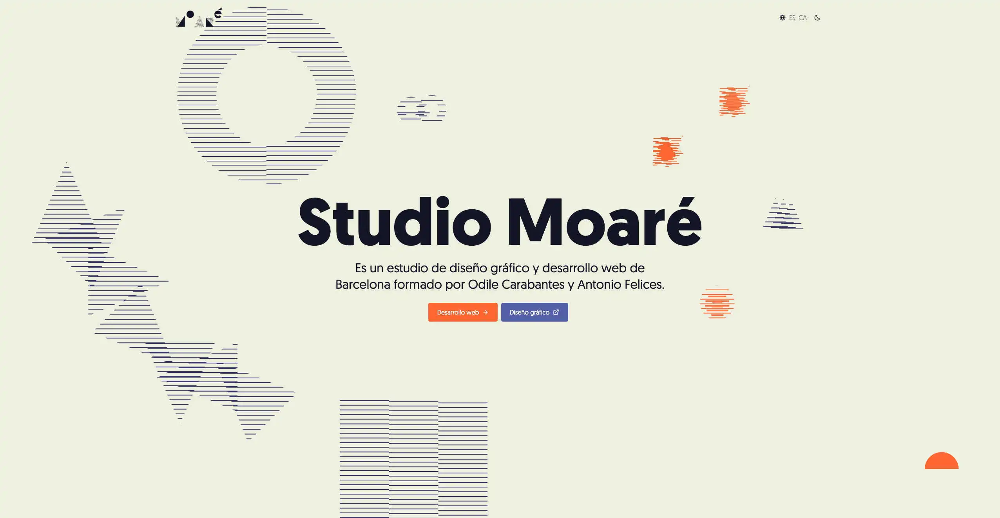

<div align="center">
    <h1>Studio Moare website</h1>
    <p>This is our website, where we showcase some of our projects and the services we offer, as well as providing a way to contact us. It is built using Astro, React and Tailwind. It is a multilingual website using i18n for translations.</p>
</div>

<div align="center">
    
    
</div>

---

## Technologies

-   Astro.
-   React.
-   Tailwind.
-   JavaScript.

## Documentation

### Installation

You can use this project as a template — simply modify the files inside the 'content' folder.

1. Clone this repo

```bash
$ git clone git@github.com:antoniofelices/studiomoare-website.git .
```

2. Install packages

```bash
$ npm install
```

3. Run develop

```bash
$ npm run dev
```

## Future Improvements

-   Refactoring all JavaScript to TypeScript.
-   Try to add projects with some frecuency.
-   Keep the dependencies update.

## Contributing

Please feel free to send pull requests and raise issues.
Any contributions you make will be under the GPL-3.0 license.
Therefore, when you submit code changes, they are understood to be covered by the same licence.

### Code of Conduct

Studio Moare has adopted the Contributor Covenant Code of Conduct that we expect project participants to adhere to. [Please read the full text](https://www.contributor-covenant.org/version/2/1/code_of_conduct/code_of_conduct.md) so that you can understand what actions will and will not be tolerated.

## License

© 2025+, Antonio Felices. Released under the [GPL-3.0 licence](./LICENSE).
