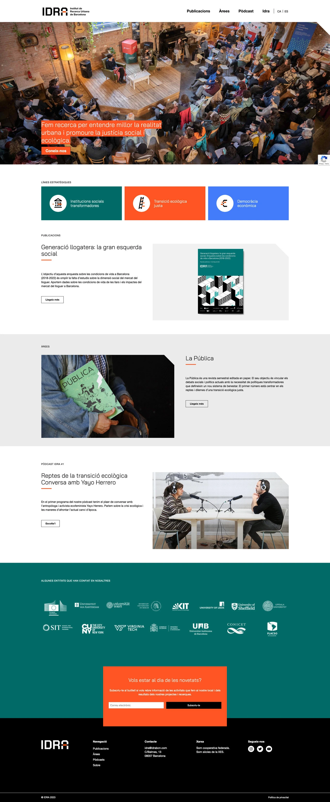

WordPress Multisitio.

Desarrollo inicial de tema personalizado con Genesis Framework, posteriormente migrado a un tema de bloques personalizado para mejorar flexibilidad y rendimiento. Creación de plugin especializado para gestión avanzada de campos personalizados.

Diseño: [Odile Carabantes](https://dileodile.com)

