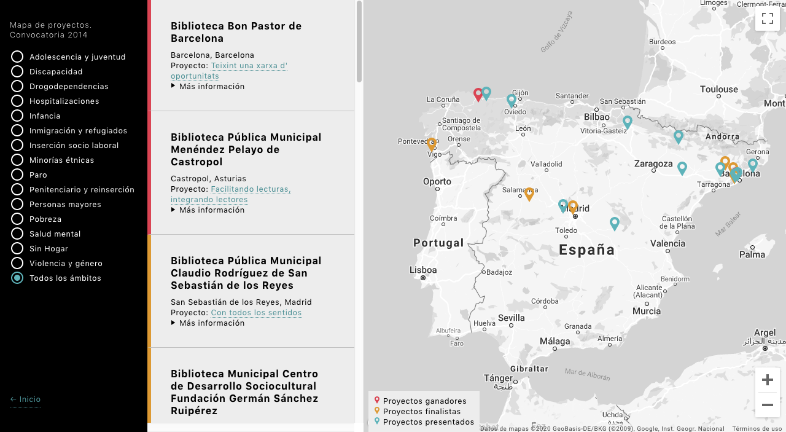
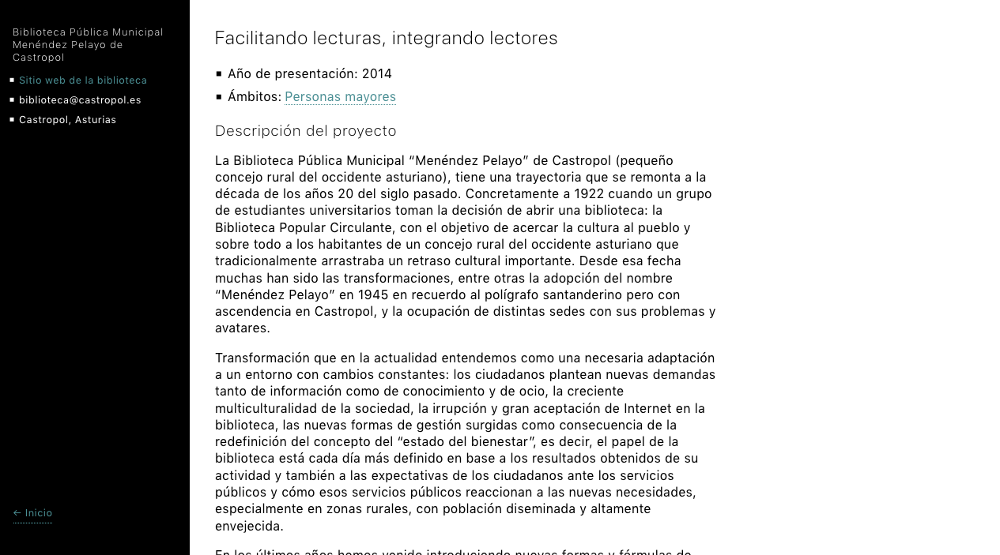

Desarrollo full-stack: creación de una Progressive Web App utilizando Gatsby, React y GraphQL, consumiendo datos del WordPress y ofreciendo una experiencia de usuario fluida y moderna para la visualización de proyectos.

-   Backend: WordPress.
-   Frontend: React, GraphQL.

