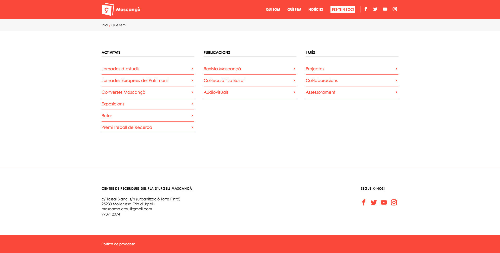
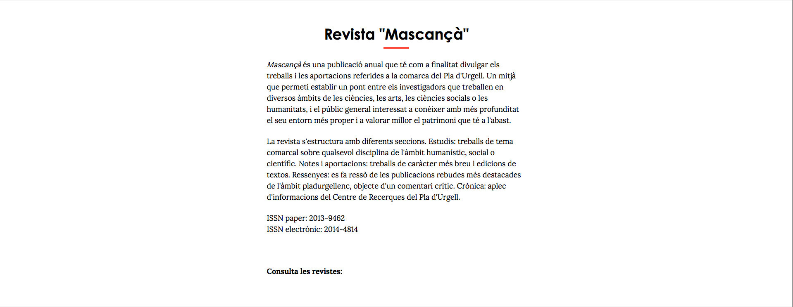
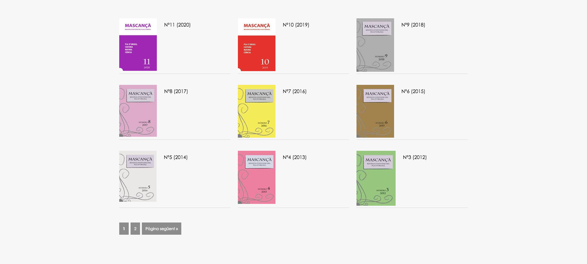

WordPress.

Genesis framework. Creación tipos de contenido y taxonomías personalizadas. Creación de campos personalizados. Desarrollo de tema a medida.

Diseño: [Odile Carabantes](https://dileodile.com)

